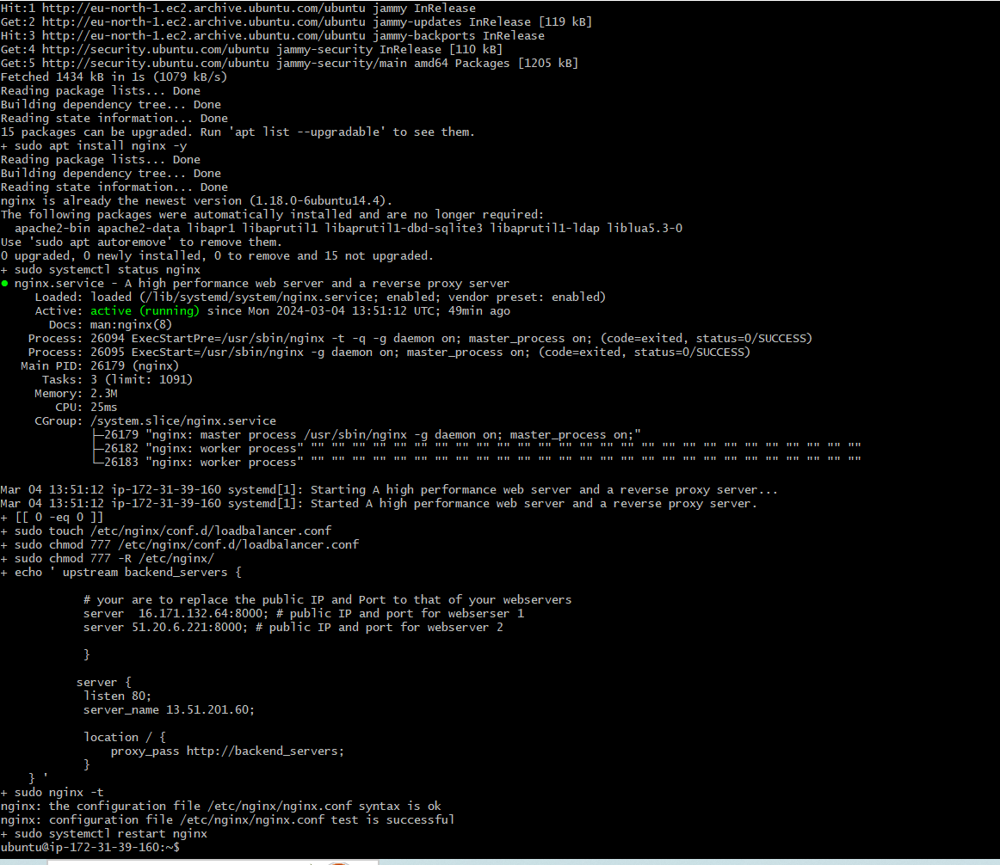
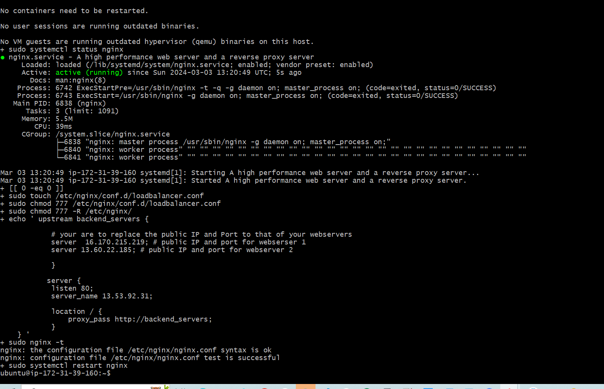
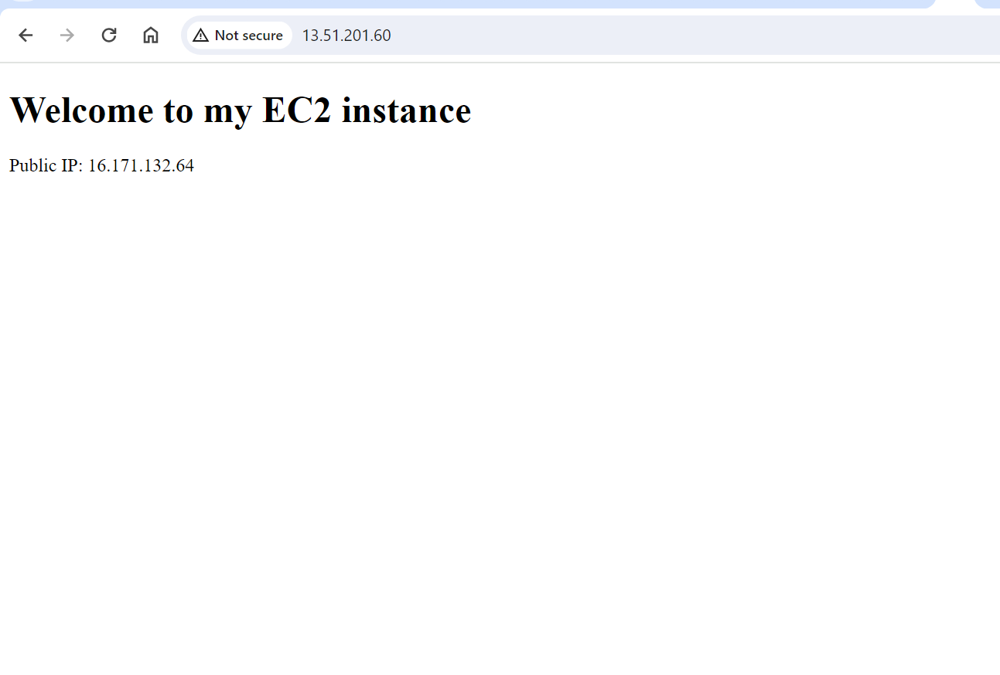
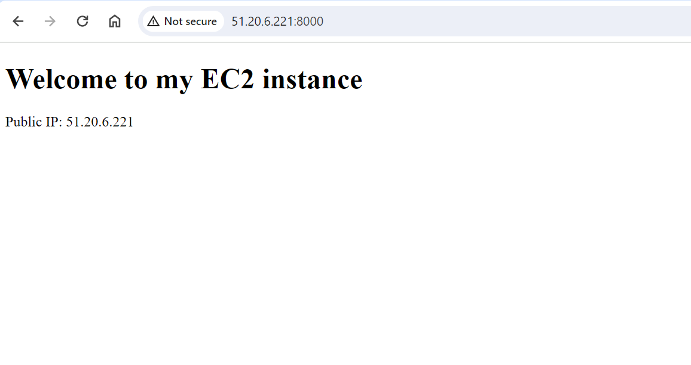
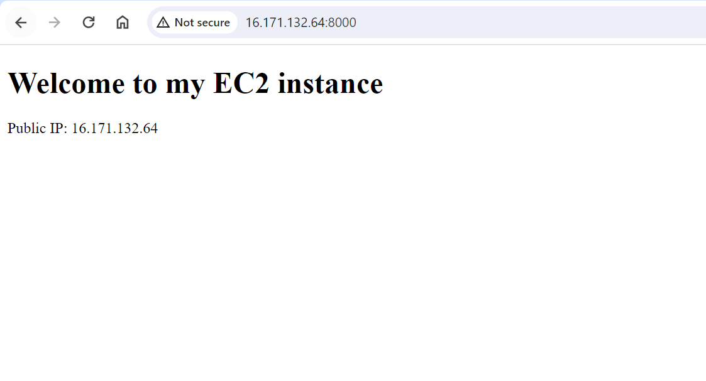

# Automating Loadbalancer configuration with Shell scripting

Streamline your load balancer configuration with ease using shell scripting and simple CI/CD on Jenkins. This project
demonstrates how to automate the setup and maintenance of your load balancer using a freestyle job, enhancing
efficiency and reducing manual effort

# Automate the Deployment of Webservers
Automate the Deployment of Webservers
In the implementing load balancer with Nginx course, We deployed two backend servers, with a load balancer
distributing traffic across the webservers. We did that by typing commands right on our terminal.
In this course we will be automating the entire process. We will do that by writing a shell script that when ran, all that
will did manually will be done for us automatically. As DevOps Engineers automation is at the heart of the work we do.
Automation helps us speed the the deployment of services and reduce the chance of making errors in our day to day
activity.
This course will give a great introduction to automation.

# Deploying and Configuring the Webservers
## Deploying and Configuring the Webservers

All the process we need to deploy our webservers has been codified in the shell script below:

` #!/bin/bash`

`####################################################################################################################`
`#####This automates the installation and configuring of apache webserver to listen on port 8000`
`#####Usage: Call the script and pass in the Public_IP of your EC2 instance as the first argument as shown below:`
`######## ./``install_configure_apache.sh 127.0.0.1`
`####################################################################################################################`

`set -x # debug mode`
`set -e # exit the script if there is an error`
`set -o pipefail # exit the script when there is a pipe failure`

`PUBLIC_IP=$1`

`[ -z "${PUBLIC_IP}" ] && echo "Please pass the public IP of your EC2 instance as an argument to the script" && exit 1`

`sudo apt update -y &&  sudo apt install apache2 -y`

`sudo systemctl status apache2`

`if [[ $? -eq 0 ]]; then`
    
`sudo chmod 777 /etc/apache2/ports.conf`
    `echo "Listen 8000" >> /etc/apache2/ports.conf`
    `sudo chmod 777 -R /etc/apache2/`

`sudo sed -i 's/<VirtualHost \*:80>/<VirtualHost *:8000>/' /etc/apache2/sites-available/000-default.conf`

`fi`

`sudo chmod 777 -R /var/www/`

`echo`
<!DOCTYPE html>
        <html>
        <head>
            <title>My EC2 Instance</title>
        </head>
        <body>
            <h1>Welcome to my EC2 instance</h1>
            
Public IP: "${PUBLIC_IP}"

        </body>
        </html>" > /var/www/html/index.html`

`sudo systemctl restart apache2`

Follow the steps below to run the script:

Step 1: Provision an EC2 instance running ubuntu 20.04. You can refer to the course Implementing load balancer with
Nginx for a refresher

Step 2: Open port 8000 to allow traffic from anyhere using the security group. Again refer to the course mentioned
above in step one for a refresher.

Step 3: Connect to the webserver via the terminal using SSH cleint

Step 4: Open a file, paste the script above and close the file using the command below:

copy Below Code

`sudo vi install.sh`

To close the file type the esc key then `Shift +:wqa!`

Step 5: Change the permissions on the file to make an executable using the command below.

Copy Below Code

`sudo chmod +x install.sh`

Step 6: Run the shell script using the command below. Make sure you read the instructions in the shell script to learn how to use it.

Copy Below Code

`./install.sh PUBLIC_IP`

# Deployment of Nginx as a Load Balancer using Shell script

Automate the Deployment of Nginx as a Load Balancer using Shell script
Having successfully deployed and configured two webservers, We will move on to the laod balancer. As a prerequisite,
we need to provision an EC2 instance running ubuntu 22.04, open port 80 to anywhere using the security group and
connect to the load balancer via the terminal.

# Deploying and Configuring Nginx Load Balancer
## Deploying and Configuring Nginx Load Balancer

All the steps followed in the Implementing Load Balancer with Nginx course has been modified in the script below:

Read the instrictions carefully in the script to learn how to use the script.

Copy Below Code

` #!/bin/bash`

`######################################################################################################################`
`#####This automates the configuration of Nginx to act as a load balancer`
`#####Usage:The script is called with 3 command line arguments. The public IP of the EC2 instance where Nginx is installed`
`#####the webserver urls for which the load balancer distributes traffic. An example of how to call the script is shown below:`
`#####./`
`configure_nginx_loadbalancer.sh`

`PUBLIC_IP Webserver-1 Webserver-2
#####`

`configure_nginx_loadbalancer.sh 127.0.0.1 192.2.4.6:8000  192.32.5.8:8000`
`############################################################################################################`

`PUBLIC_IP=$1`
`firstWebserver=$2`
`secondWebserver=$3`

`[ -z "${PUBLIC_IP}" ] && echo "Please pass the Public IP of your EC2 instance as the argument to the script" && exit 1`

`[ -z "${firstWebserver}" ] && echo "Please pass the Public IP together with its port number in this format: 127.0.0.1:8000 as the second argument to the script" && exit 1`

`[ -z "${secondWebserver}" ] && echo "Please pass the Public IP together with its port number in this format: 127.0.0.1:8000 as the third argument to the script" && exit 1`

`set -x # debug mode`
`set -e # exit the script if there is an error`
`set -o pipefail # exit the script when there is a pipe failure`

`sudo apt update -y && sudo apt install nginx -y`

`sudo systemctl status nginx`

`if [[ $? -eq 0 ]]; then`

`sudo touch /etc/nginx/conf.d/loadbalancer.conf`

`sudo chmod 777 /etc/nginx/conf.d/loadbalancer.conf`

`sudo chmod 777 -R /etc/nginx/`

    
    echo " upstream backend_servers {

            # your are to replace the public IP and Port to that of your webservers
            server  "${firstWebserver}"; # public IP and port for webserser 1
            server "${secondWebserver}"; # public IP and port for webserver 2

            }

           server {
            listen 80;
            server_name "${PUBLIC_IP}";

            location / {
                proxy_pass http://backend_servers;   
            }
    } " > /etc/nginx/conf.d/loadbalancer.conf
`fi`

`sudo nginx -t`

`sudo systemctl restart nginx`

