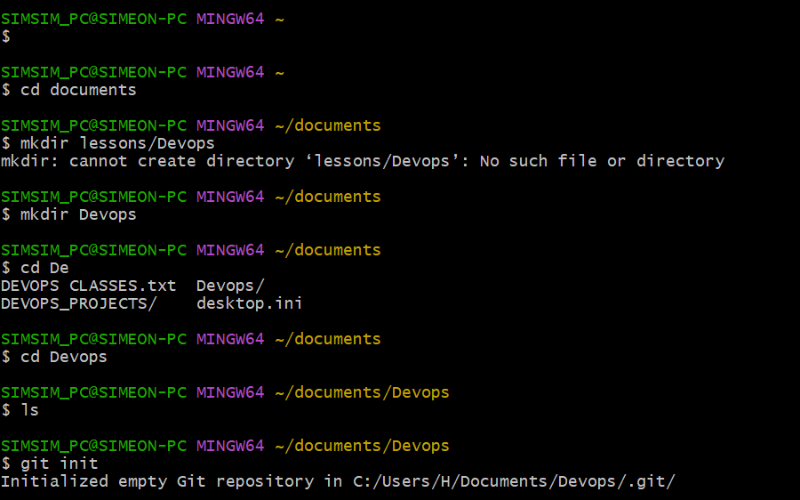
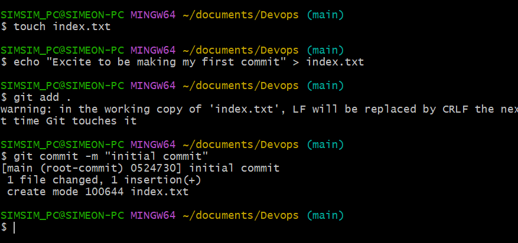
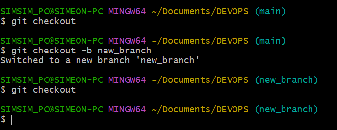
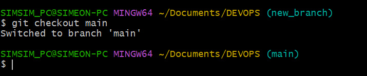
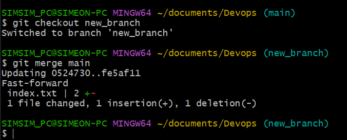
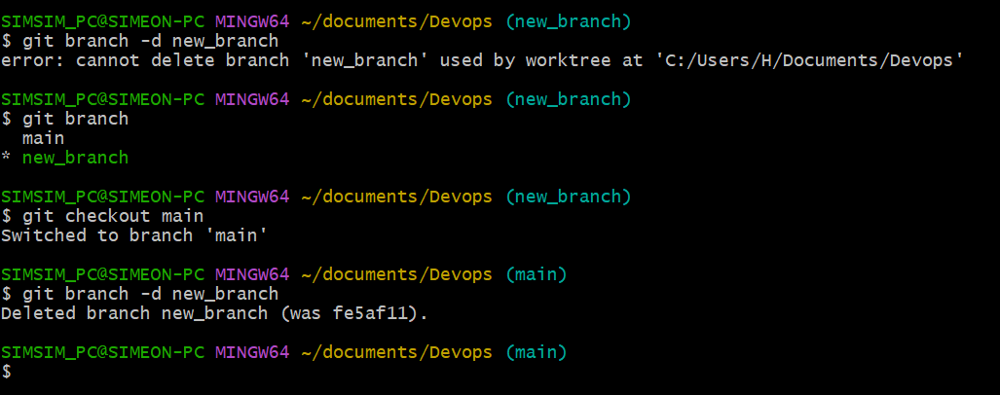
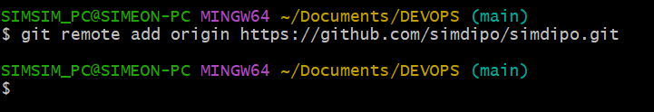
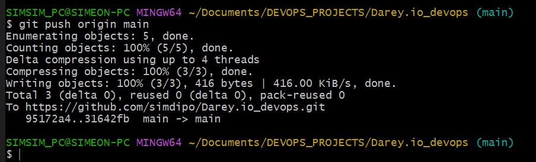
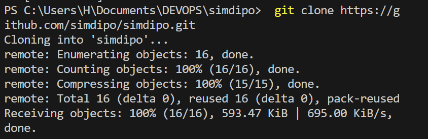

# Git Project
### What is Git
Git is a distributed version control system. This is a typical definition you will find on the internet.
Git essentially solves the problem of sharing source code efficiently and keeping track of changes made to
source code

# Initializing a Repository and Making Commits
Initializing a Repository and Making Commits
Before diving into our main objective which is initializing git and making commits, Iets start by introducing Git.

Before Git, there were other technologies available that solves this prob|em a good example is SVN.
The way that SVN solved this problem posed some challenges. In SVN there exist a central source code repository. Every
change by developers is made against this central repository. This setup makes it difficult for developers to collaborate
because changes can only be made one at time. Secondly if for any reason the central server goes down or is not reacheable that effectively blocks the developers.
Git adopted a different approach. It allows developers make their own copy of the central repository. That is why it is
referred to as a Distributed Version Control System.
### Initializing a Git Repository

### Making your first Commit

# Working with Branches
### Working with Branches
Git branch is commonly used to develop new feature of an application.
Git branch is also an important tool for collaboration within remote teams(developers working from different location).
They can make separate branches while working on same feature. And at the end of the day, converge their code to one
branch.
## Make you first git Branch
To make a new branch run this command: git checkout -b
The-b flag helps your create and change into the new branch

## Listing your git branches

## Change into an old branch

## Merging a branch into anothe branch

## Deleting a git branch

# Collaboration and Remote Repositories.
### Pushing your local git to your remote github repository

### Git push

### Clonning remote Git Repository

