# LAMP STACK IMPLEMENTATION
The Project *(LAMP Stack)*  is a comprehensive program designed for individuals seeking to build and deploy web
applications using the *LAMP* stack. This course offers a hands-on learning experience, guiding participants through the
process of creating dynamic websites by combining Linux, Apache, MySQL, and PHP. Throughout the course and project
implementation, I have gained a solid understanding of the LAMP stack components and their roles in web
application development. Starting with an introduction to the LAMP stack architecture.

## WEB STACK IMPLEMENTATION (*LAMP STACK*) IN AWS
I have realised that everything will be doing as a DevOps engineer is
around software, websites, applications etc. And, there are different stack of technologies that make different solutions
possible. These stack of technologies are regarded as WEB STACKS. Examples of Web Stacks include *LAMP, LEMP
MEAN, and MERN* stacks.

### What is a Technology stack?
A technology stack is a set of frameworks and tools used to develop a software product. This set of frameworks and
tools are very specifically chosen to work together in creating a well-functioning software. They are acronymns for
individual technologies used together for a specific technology product. some examples are..

1. LAMP (Linux, Apache, MySQL, PHP or Python, or Perl)

2. LEMP (Linux, Nginx, MySQL, PHP or Python, or Perl)

3. MERN (MongoDB, ExpressJS, ReactJS, NodeJS)

4. MEAN (MongoDB, ExpressJS, AngularJS, NodeJS

- Connecting to the EC2 instance using the terminal.

- Connect to the instance by running

`ssh -i "devops.pem" ubuntu@ec2-16-171-133-147.eu-north-1.compute.amazonaws.com`

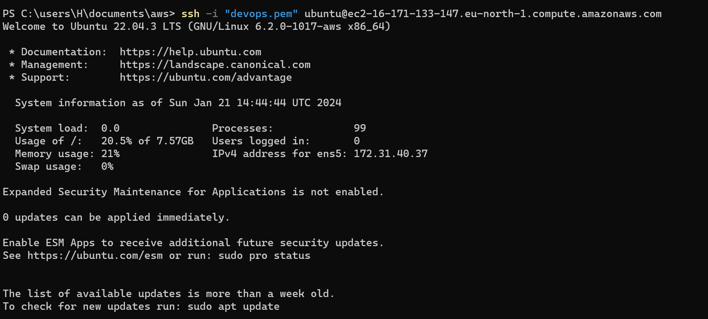

## Installing Apache and Updating the Firewall
Step 1- Installing Apache and Updating the Firewall
What exactly is Apache?
Apache HTTP Server is the most widely used web server software. Developed and maintained by Apache Software
Foundation, Apache is an open source software available for free. It runs on 67% of all webservers in the world. It is fast.
reliable, and secure. It can be highly customized to meet the needs of many different environments by using extensions
and modules. Most WordPress hosting providers use Apache as their web server software. However, websites and
other applications can run on other web server software as well. Such as Nginx, Micrelmft's l1S, etc.
The Apache web server is among the most popular web servers in the world. It's well documented, has an active
community of users, and has been in wide use for much of the history of the web, which makes it a great default choice
for hosting a website
## Install Apache using Ubuntu's package manager.
### Step 1 - Install Apache using Ubuntu's package manager.
- update a list of packages in package manager.

`sudo apt update`

- run apache2 package installation

`sudo apt install apache2`

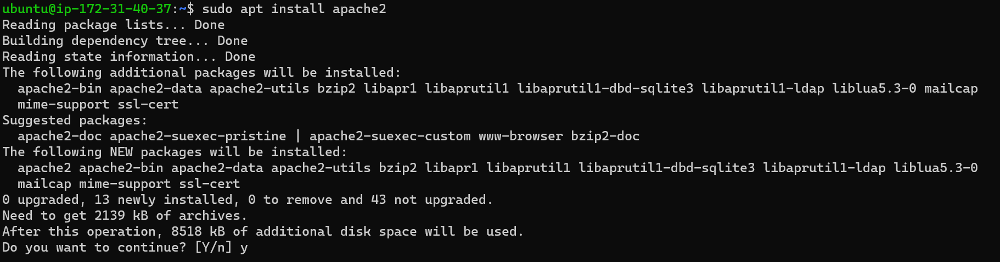

To verify that apache2 is running as a service

`sudo systemctl status apache2`

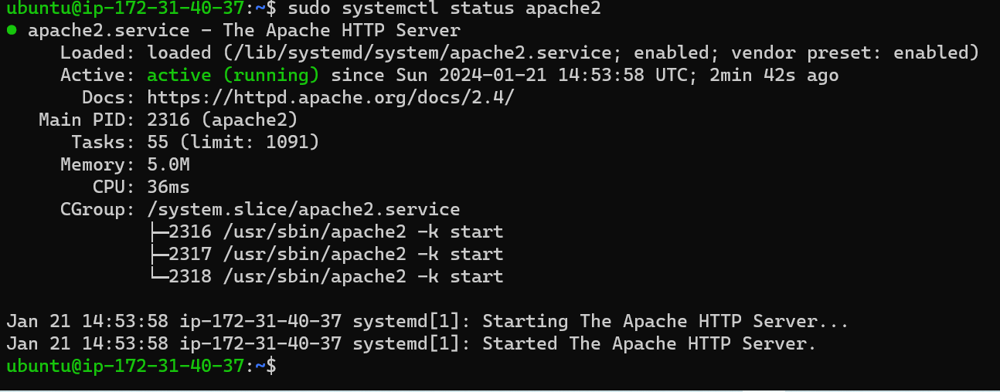

To verify if we can access it locally in our Ubuntu shell

`curl http://localhost:80`

or

`curl http://127.0.0.1:80`

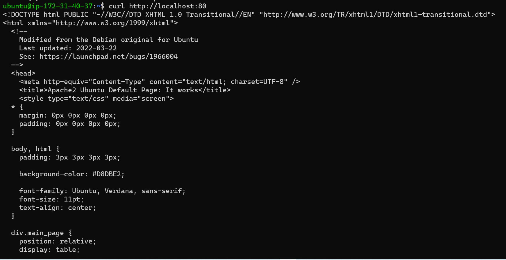
or
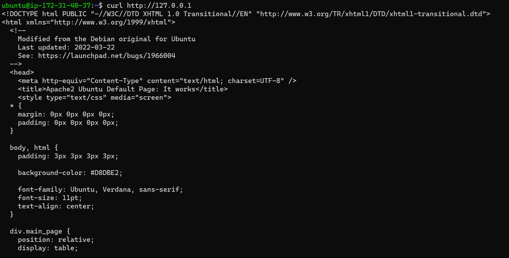

Another way to retrieve the Pubic address

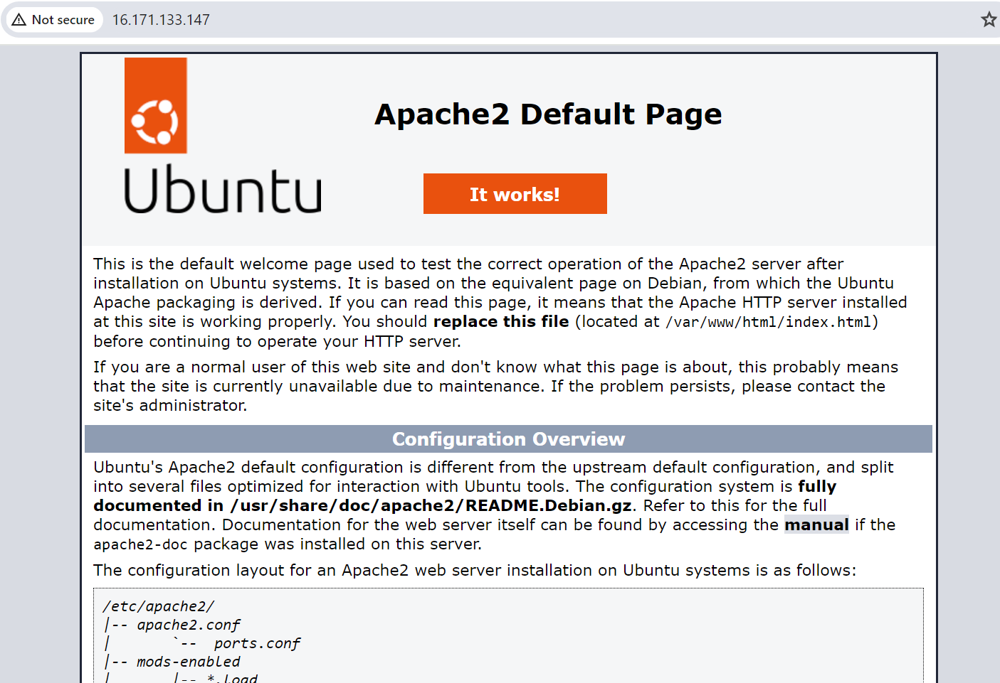

## Installing Mysql
### Step 2 - Installing Mysql

Now that I have a web server up and running, I need to install a Database Management System (DBMS) to be able
to store and manage data for my site in a relational database. 

MySQL is a popular relational database management
system used within PHP environments, so we will use it in our project.

`sudo apt install mysql-server`

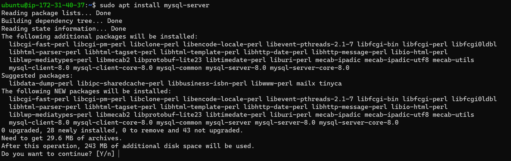

When prompted, confirm installation by typing and then ENTER
When the installation is finished, log in to the MysQL console by typing,

`sudo mysql`

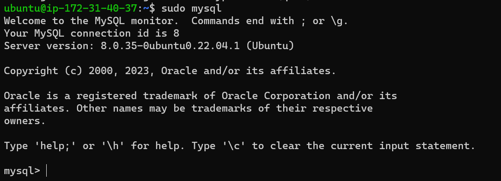

This will connect to the MySOL server as the administrative database user root, which is inferred by the use of sudo

To set a password for the sql we run the command below: MAking sure we use password as PassWord.1 which can can chage later

`ALTER USER 'root'@'localhost' IDENTIFIED WITH mysql_native_password BY 'PassWord.1';`

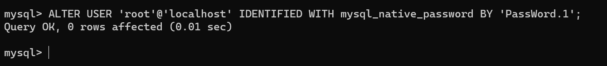

- Exit the MYSQL

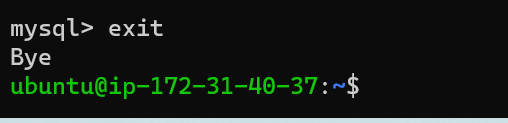

Start the interactive script by running

`sudo mysql_secure_installation`

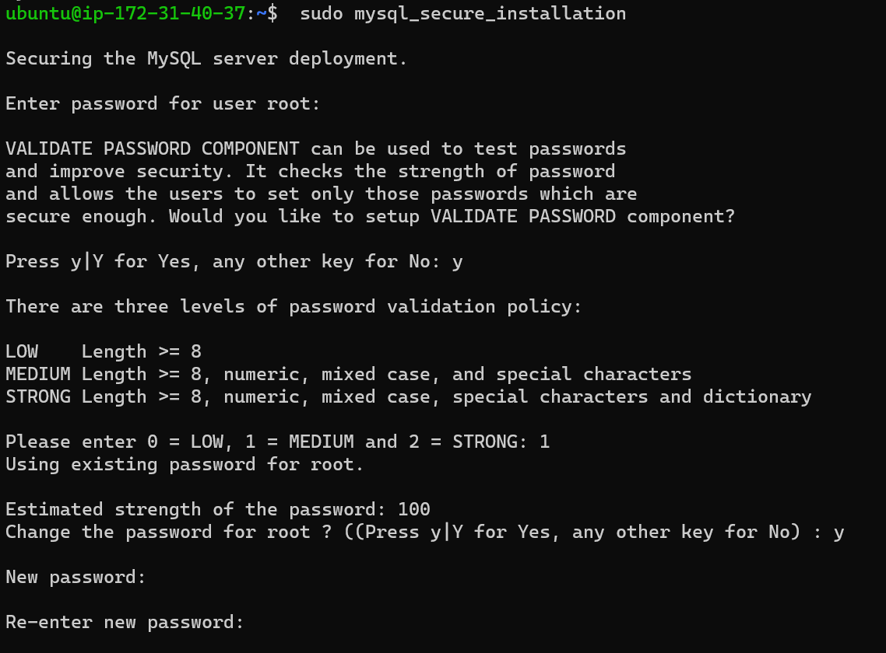

- To exit mysql console type exit.

## Installing PHP
### Step 3 - Installing PHP

`sudo apt install php libapache2-mod-php php-mysql`

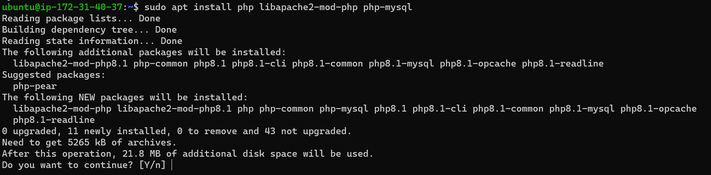

To confirm the version of PHP installed run the command below

`php -v` 

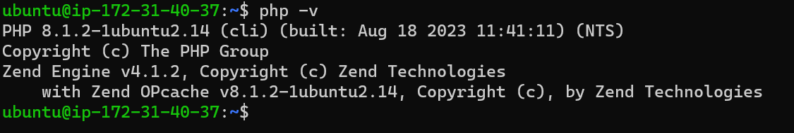

At this point, your LAMP stack is completely installed and fully operational.
- Linux (Ubuntu)
- Apache HTTP Server
- MySQL
- PHP

## Enable PHP on the website
### Step 4- Enable PHP on the website
With the default Directorylndex settings on Apache, a file named *index.html* will always take precedence over an 
*index.php*  file. This is useful for setting up maintenance pages in PHP applications, by creating a temporary

*index.html* file containing an informative message to visitors. Because this page willtake precedence over the
*index.php* page, it will then become the landing page for the application. Once maintenance is over, the ndex. html
isrenamed or removed from the document root, bringing back the regular application page.

In case you want to change this behavior, you'll need to edit the **/etc/apache2/mods-enabled/dir.conf** file and change the
order in which the *index.php* file is listed within the DirectoryIndex directive:

To edit the dir.conf using `vim`

`sudo vim /etc/apache2/mods-enabled/dir.conf`

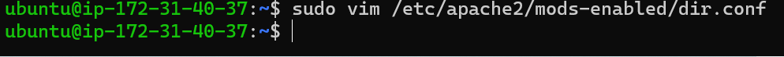

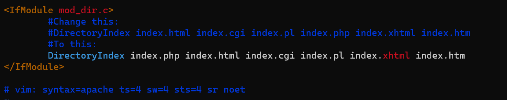

- After saving and closing the file, a restart is required to reload the apache for the chages to take effect

`sudo systemctl reload apache2`

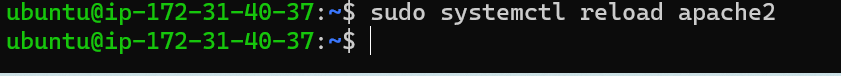

- Now we need to create a new filenamed *index.php* inside your custom web root folder.

`vim /var/www/projectlamp/index.php`

This will open a blank file and then the code below is added to validate the php code.

`<?php`

`phpinfo();`

`?>`

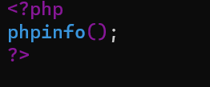

it is best to remove the file created as it contains sensitive information about the PHP environmentand the ubuntu server, which can be removed with  `rm`

`sudo rm /var/www/projectlamp/index.php`

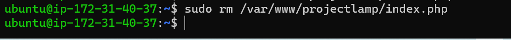

## Creating a Virtual Host for your Website using Apache
### Step 5 -Creating a Virtual Host for your Website using Apache
In this project, we will set up a domain called *projectlamp* , but you can replace this with any domain of your choice.

Apache on Ubuntu 20.04 has one server block enabled by default that is configured to serve documents from the
/var/www/html directory. We will leave this configuration as is and will add our own directory next to the default.
one.

Create the directory for projectlamp using '`mkdir`' command as follows:

`sudo mkdir /var/www/projectlamp`

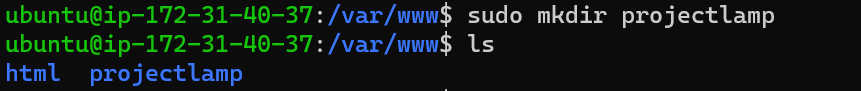

Next, assign ownership of the directory with the user environment variable, which will reference your current
system user:

`sudo chown -R $USER:$USER /var/www/projectlamp`

Then, create and open a new configuration file in Apache sites available directory using your preferred command-
line editor. Here,we'll be using `vi` or `vim` (They are the same by the way):

`sudo vi /etc/apache2/sites-available/projectlamp.conf`

- This will create a new blank file which we have to edit and insert the command and this is shown below:

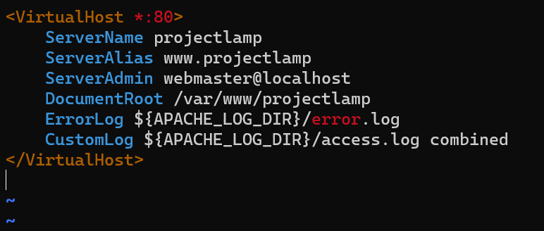

With the help of the `ls` command we will see below 

`sudo ls /etc/apache2/sites-available`

You will see something like this

- 000-default.conf  
- default-ssl.conf  
- projectlamp.conf

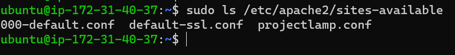

With this VirtualHost configuration, we're telling Apache to serve *project lamp*  using **/var/www/projectlamp** as its
web root directory. 

If you would like to test Apache without a domain name, you can remove or comment out the
options ServerName and Server Alias by adding a # character in the beginning of each option's lines. Adding the #
character there will tell the program to skip processing the instructions on thoselines.
You can now use a2ensite command to enable the new virtual host:

`sudo a2ensite projectlamp`

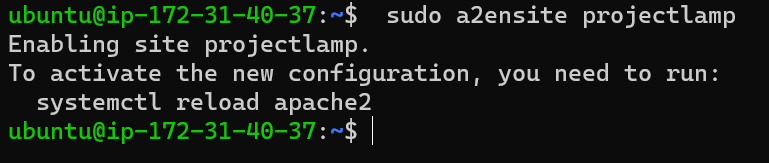

You might want to disable the default website that comes installed with Apache. This is required if you're not using a
custom domain name, because in this case Apache's default configuration would overwrite your virtual host. To disable

Apache's default website use a2disite command.

`sudo a2dissite 000-default`

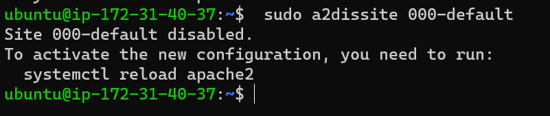

To make sure your configuration file doesn't contain syntax errors.

`sudo apache2ctl configtest`

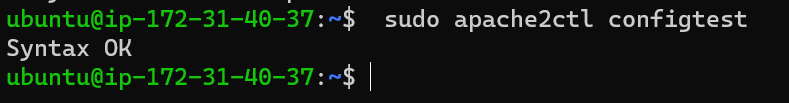

- Finally, reload Apche so these changes can take effect.

`sudo systemctl reload apache2`

Your new website is now active, but the web root **/var/www/projectlamp** is still empty. 

Create an *index.html* file in that
location so that we can test that the virtual host works as expected:

Now go to your browser and try to open your website URL using IP address:

In the output you will see your server' 's public hostname (DNS name) and public IP address. You can also
access your website in your browser by publicDNS name, not only by IP-try it out, the result must be the same.

`http://<Public-IP-Address>:80`

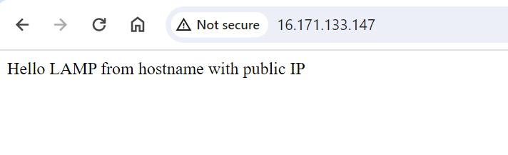

