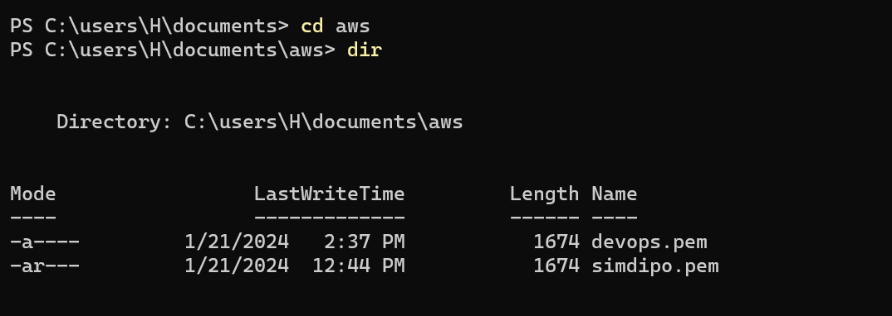

# LAMP STACK IMPLEMENTATION
The Project(LAMP Stack) is a comprehensive program designed for individuals seeking to build and deploy web
applications using the LAMP stack. This course offers a hands-on learning experience, guiding participants through the
process of creating dynamic websites by combining Linux, Apache, MySQL, and PHP. Throughout the course and project
implementation, participants will gain a solid understanding of the LAMP stack components and their roles in web
application development. Starting with an introduction to the LAMP stack architecture, learners will explore the
benefits and advantages of using this powerful combination of technologies.

## WEB STACK IMPLEMENTATION (LAMP STACK) IN AWS
Welcome to your very first PBL Project
You must be really excited to start getting your hands dirty. There is a lot of projects ahead, S0 without any delay, let's
get started.
As you kick off your career in DevOps, you will soon realise that everything you will be doing as a DevOps engineer is
around software, websites, applications etc. And, there are different stack of technologies that make different solutions
possible. These stack of technologies are regarded as WEB STACKS. Examples of Web Stacks include LAMP, LEMP
MEAN, and MERN stacks. As you proceed in your journey, you will be required to understand and implement all of these
technology stacks. Lets have a short close up on what a Technology stack is.

### What is a Technology stack?
A technology stack is a set of frameworks and tools used to develop a software product. This set of frameworks and
tools are very specifically chosen to work together in creating a well-functioning software. They are acronymns for
individual technologies used together for a specific technology product. some examples are..
LAMP (Linux, Apache, MySQL, PHP or Python, or Perl)
LEMP (Linux, Nginx, MySQL, PHP or Python, or Perl)
MERN (MongoDB, ExpressJS, ReactJS, NodeJS)
MEAN (MongoDB, ExpressJS, AngularJS, NodeJS

