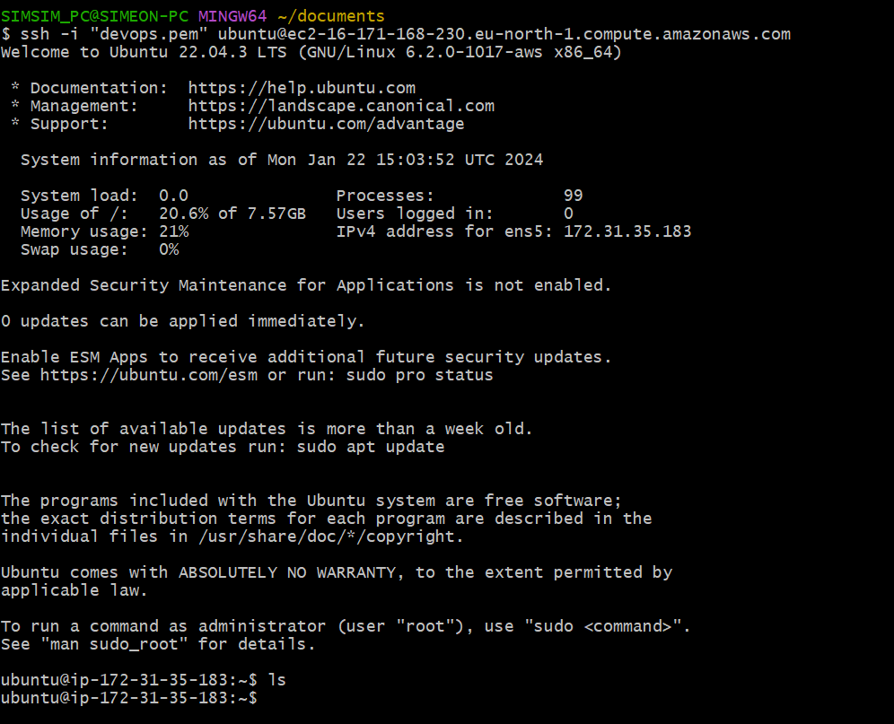
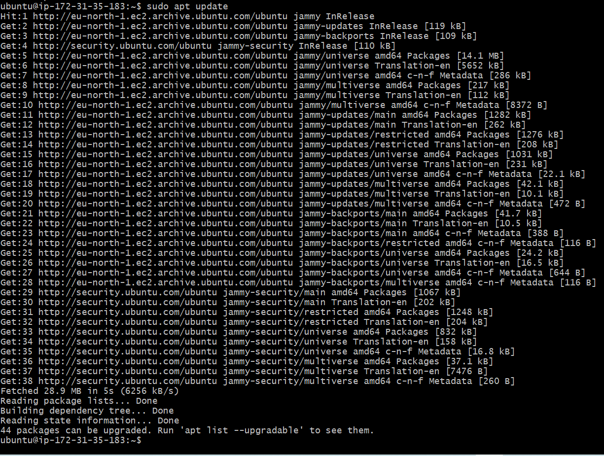
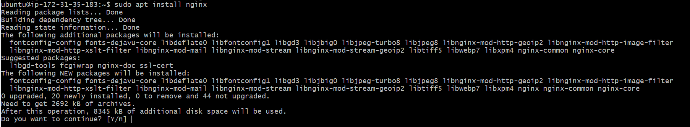
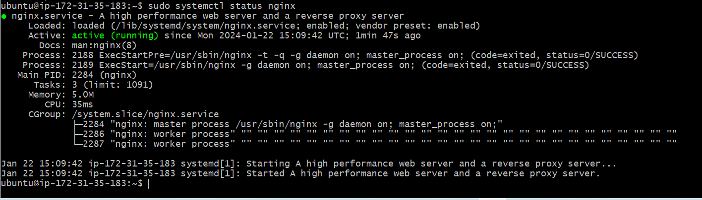
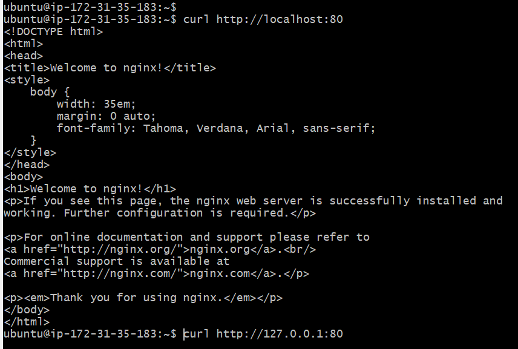
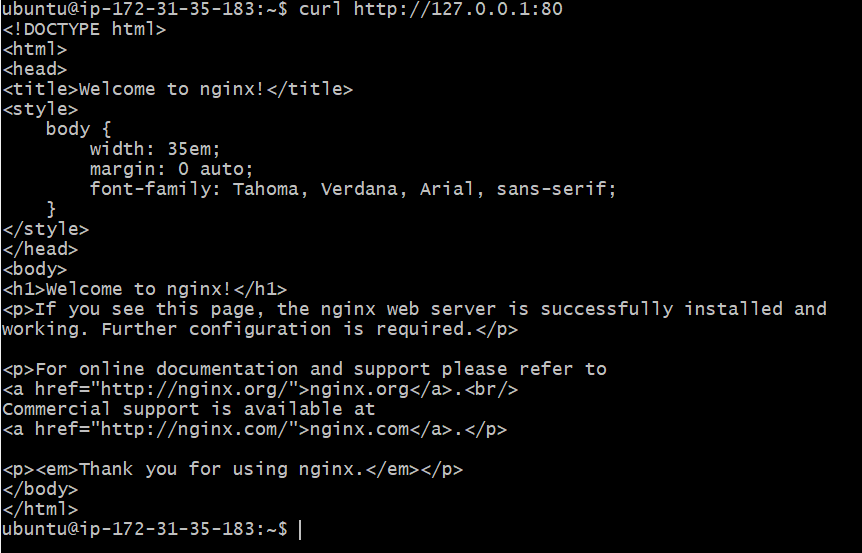

# Web Stack Implementation (LempStack)

 This comprehensive course/project takes us through a hands-on
adventure, guiding us step-by-step in harnessing the power of Linux, Nginx, MySQL, and PHP to create dynamic and
high-performing websites. We will dive into the architecture of the LEMP stack, understanding how Linux provides a
solid foundation, Nginx serves as a powerful web: server, MySQL handles the databases, and PHP empowers: server- side
functionality.
Throughout the course/project, we will set up a Linux environment, configure Nginx for optimal performance, manage
MySQL databases, and develop PHP code to bring applications tolife. Through the practical and hands-on exercises, you
willgain proficiency in building dynamic websites with the LEMP stack. We will explore techniques for handling user
requests,interacting with databases, processing forms, and implementing robust security measures. Furthermore,
introduce us to popular development frameworks and tools that can elevate our productivity and simplify the web
application development process.

Lunch Gitbash and run the following command.

 `ssh -i "devops.pem" ubuntu@ec2-16-171-168-230.eu-north-1.compute.amazonaws.com`

 

 # Installing the Nginx Web Server
### Step 1- Installing the Nginx Web Server
In order to display web pages to our site visitors, we are going to employ Nginx, a high-performance web server. Well
use the apt package manager to install this package.

Since this is our first time using `apt` for this session, start off by updating your server's package index. Following that,
you can use apt install to get Nginx installed:

`sudo apt update`
 

`sudo apt install nginx`

 

When prompted, enter
to confirm that you want to install Nginx. Once the installation is finished, the Nginx web
server will be active and running on your Ubuntu 20.04 server.
To verify that nginx was successfully installed and is running as a service in Ubuntu, run:

`sudo systemctl status nginx`

 

If it is green and running, then you did everything correctly -you have just launched your first Web Server in the Clouds!

Let us check how we can access it from Ubuntu shell.

`curl http://localhost:80`

or

`curl http://127.0.0.1:80`

