# Implementing Loadblancers with Nginx

Discover the art of load balancing with Nginx in this project. Learn how to distribute traffic efficiently across multiple
servers, optimize.performance, and ensure high availability for your web applications

## Introduction to Load Balancing and Nginx
Introduction to Load Balancing and Nginx

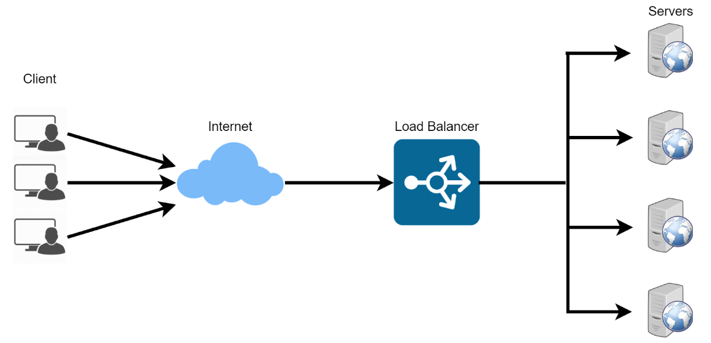

Load balancing is like having a team of helpers working together to make sure a big job gets done smoothly and
efficiently. Imagine you have a lot of heavy boxes to carry, but you can't carry them all by yourself because they are too
heavy.

Load balancing is when you call your friends to help you carry the boxes. Each friend takes some of the boxes and carries
them to the right place. This way, the work gets done much faster because everyone is working together.

In computer terms, load balancing means distributing the work or tasks among several computers or servers so that no
one computer gets overloaded with too much work. This helps to keep everything running smoothly and ensures that
websites and apps work quickly and don't get too slow. It's like teamwork for computers!

Lets say you have a set of webservers serving a serving your website. In other to distribute the traffic evenly between
the webservers, a load balancer is deployed. The load balancer stands in front of the webservers, all traffic gets to it first, it then distributes the traffic across the set of webservers. his is to ensure no webserver get over worked, consequently improving system performance.

Nginx is a versatile software, it can act like a webserver, reverse proxy, and a load balancer etc. All that is needed is to
confgure it properly to server your use case.

In this project we will be wor king you through how to configure Nginx as a load balancer.

# Setting Up a Basic Load Balancer
## Setting Up a Basic Load Balancer
We are going to be provisioning two EC2 instances running ubuntu 22.04 and install apache webserver in them. We will
open port 8000 to allow traffic from anywhere, and finaly update the default page of the webservers to display their
public IP address.

Next we will provision another 'EC2 instance running ubuntu, 22.04, this time we will install Nginx and configure it to act as a load balancer distributing traffic across the webservers.

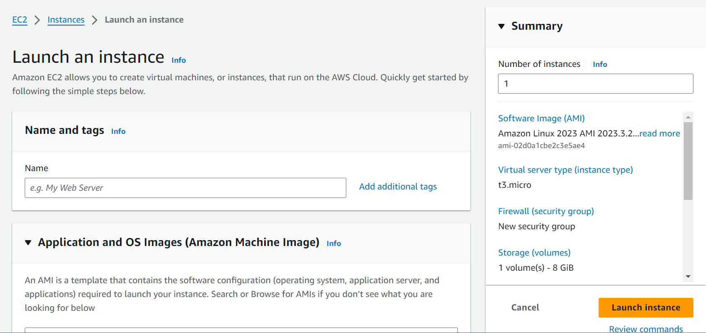

Step 1: Provisioning EC2 instance

Open your AWS Management Console, click on EC2. Scroll down the page and click on Launch instance:

Under Name, Provide a unique name for each of your webservers

Under Applications and OS Images, click on quick start and click on ubuntu:

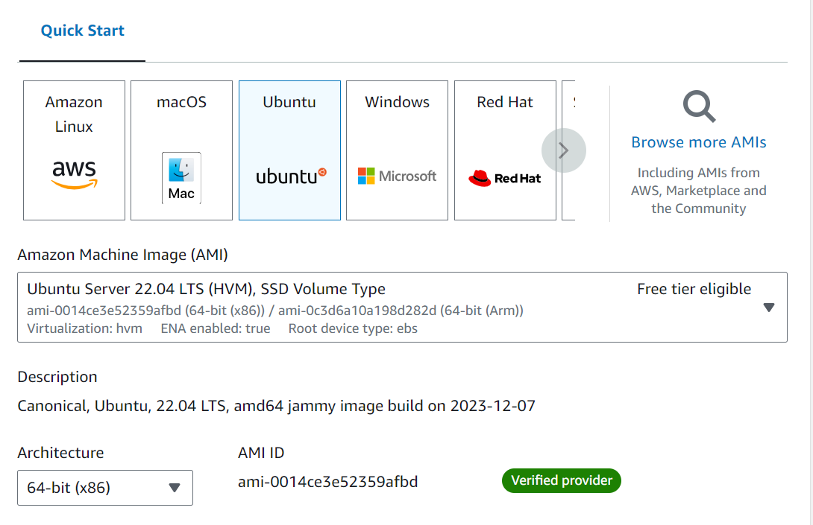

Under Key Pair,click on create new key pair if you do not have one. You can use the same key pair for all the
instances

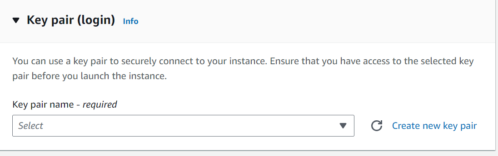

And finally click on Launch Instance

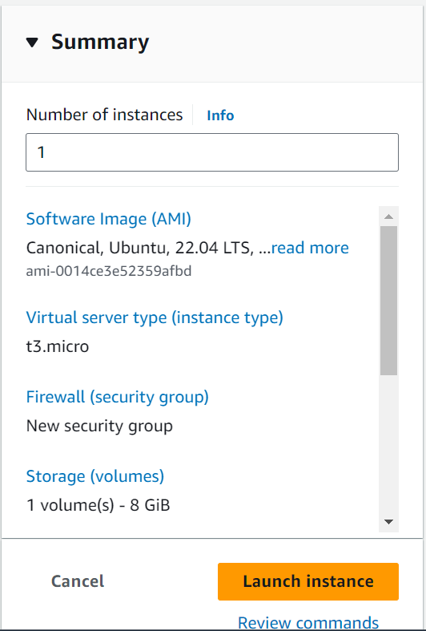

Step 2: Open Port 8000 We willbe running our webservers on port 8000 while the load balancers runs on port 80. We
need to open port 8000 to allow traffic from anywhere. To do this we need to add a rule to the security group of each of
our webservers

Click on the instance ID to get the details of your EC2 instance.

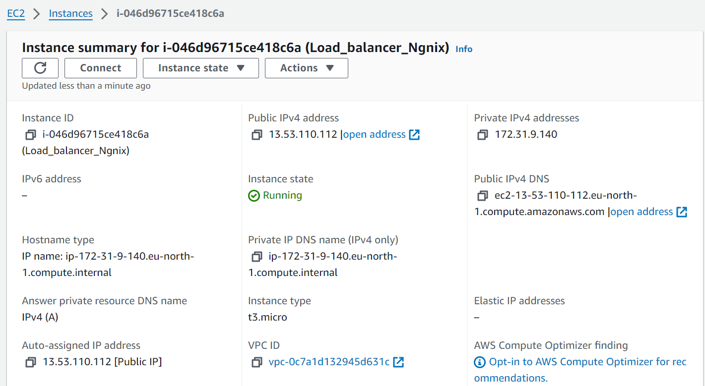

On that same page, click on scroll down and click on securiy

Click on security group

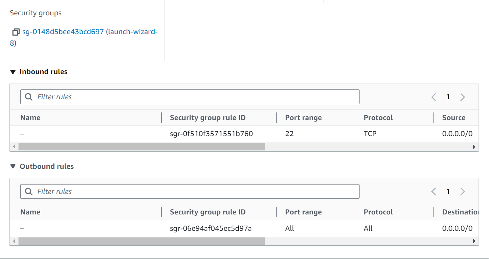

On the top of the page click on Action and select Edit inbound rules:

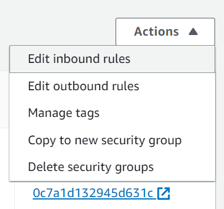

Add your rule

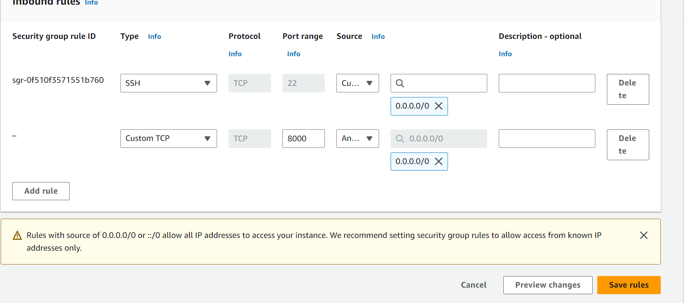

Click on save rules.

Step 3: Install Apache Webserver
After provisioning both of our servers and have opened the necessary ports, Its time to install apache software on both
servers. To do so we must first connect to each of the webserver via ssh. Then we can now run commands on the
terminal of our webservers.

Connecting to the webserver: To connect to the webserver, click on your instance Id, at the top of the page click on connect.

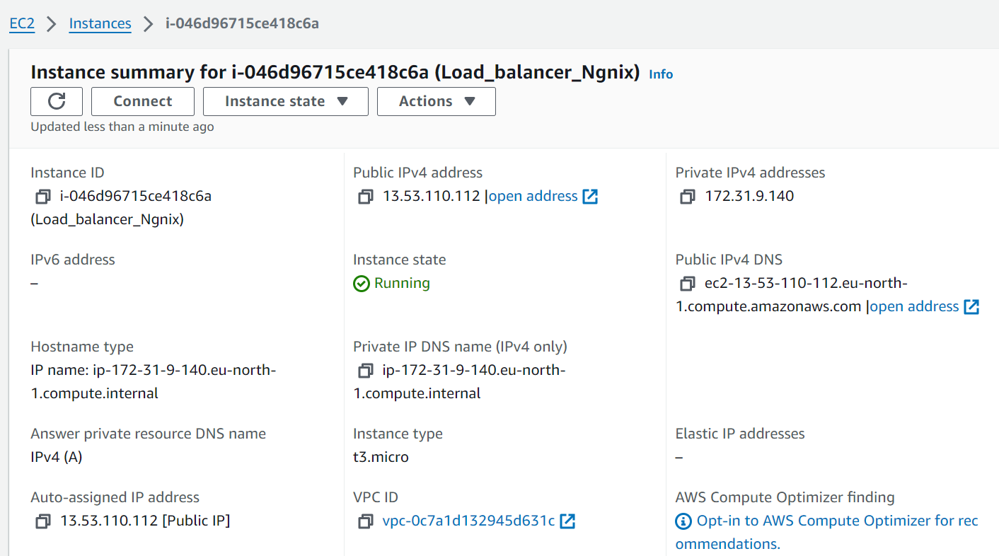

Next copy the ssh command below:

`copy-ssh-command`

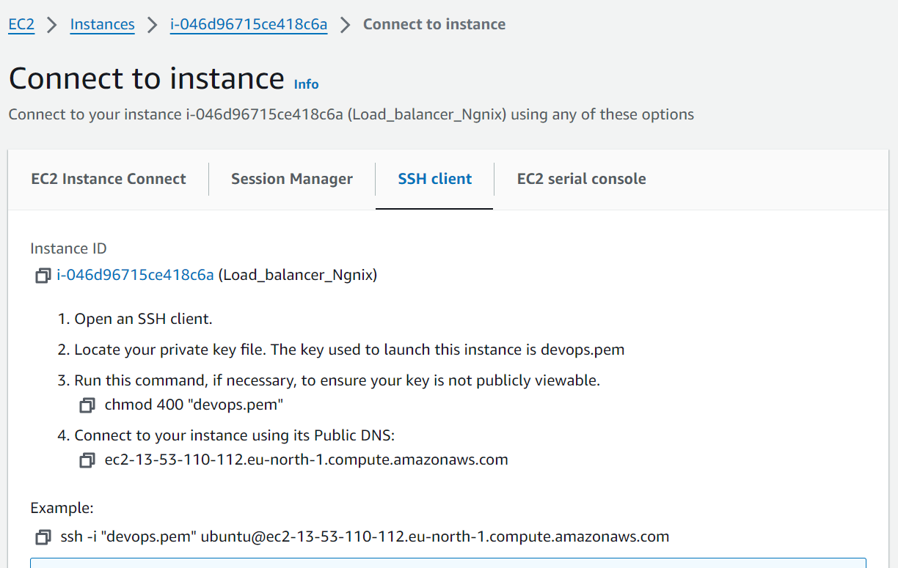

Open a terminal in your local machine, cd into your Downloads folder. Paste the ssh command you copied in the
previous step

Click on enter and type yes when prompted. You should be connected to a terminal on your instance.

Next install Apache with the command below:

sudo apt update -y &&  sudo apt install apache2 -y

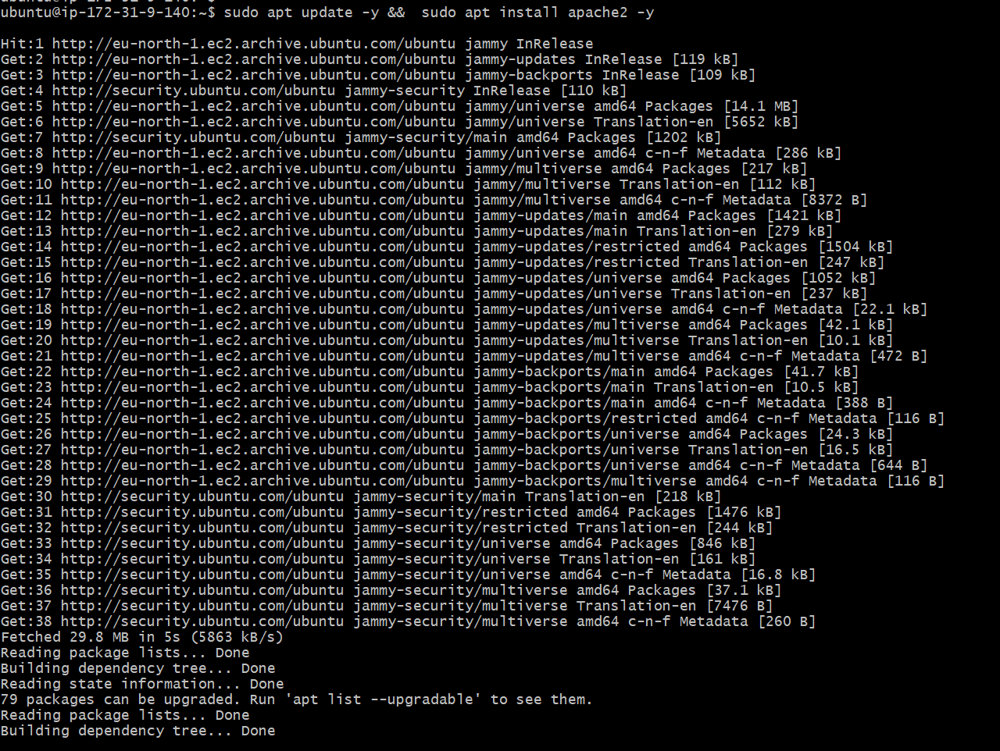

Verify that apache is running with the command below:

sudo systemctl status apache2

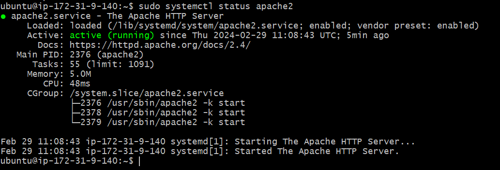

Step 4: Configure Apache to server a page showing its public IP:
We will start by configuring Apache webserver to serve content on port 8000 instead of its default which is port 80.
Then we will create a new index.html file. The file will contain code to display the public IP of the EC2 instance. We will
then override apache webserver's default html file with our new file.
Configuring Apache to Serve content on port 8000:

1. Using your text editor(eg vi, nano) open the file /etc/apache2/ports.conf

Copy Below Code

`sudo vi /etc/apache2 ports.conf`

2. Add a new Listen directive for port 8000: First type i to switch the editor to insert mode. Then add the
listen directive. Then save your file

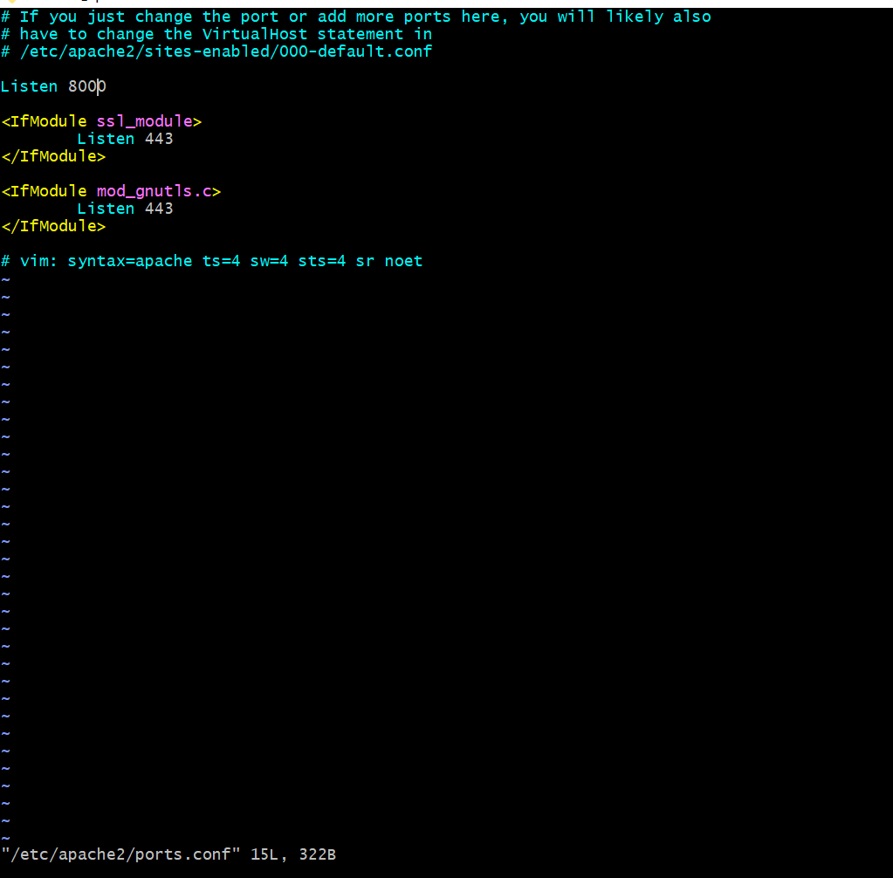

3. Next open the file /etc/apache 2/sites-available/000-default.conf and change port 80 on the virtualhost to
8000 like the screenshot below:

Copy Below Code

`sudo vi /etc/apache2/sites-available/000-default.conf`

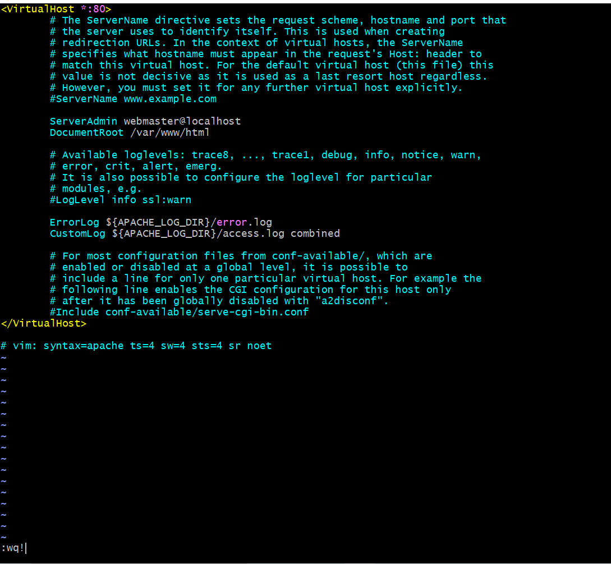

4. Close the file by first pressing the esc key on your keyboard then the command below:

Copy Below Code

`:wqal`

5. Restart apache to load the new configuration using the command below:

Copy Below Code

`sudo systemctl restart apache2`

Creating our new html file:

1. Open a newindex.html file with the command below:

Copy Below Code

`sudo vi index.html`

2. Switch vi editor to insert mode and paste the html file below. Before pasting the html file, get the public IP
of your EC2 instance from AWS Management Console and replace the placeholder text for IP address in
the html file

Copy Below Code

        `<!DOCTYPE html>
        <html>
        <head>
            <title>My EC2 Instance</title>
        </head>
        <body>
            <h1>Welcome to my EC2 instance</h1>
            
Public IP: YOUR_PUBLIC_IP

        </body>
        </html>`

3. Change file ownership of the index.html file with the command below:
Copy Below Code

`sudo chown www-data:www-data ./index.html`

Overriding the Default html file of Apache Webserver:

1. Replace the default html file with our new html file using the command below:

Copy Below Code

`sudo cp -f ./index.html /var/www/html/index.html`

2. Restart the webserver to load the new configuration using the command below:

Copy Below Code

`sudo systemctl restart apache2` 

3. You should find a page on the browser like so:

Step 5: Configuring Nginx as a Load Balancer
Provision a new EC2 instance running ubuntu 22.04. Make sure port 80 is opened to accept traffic from
anywhere. Your can refer to step 1 through
 step 2 to refresh your memory.
Next SSH into the instance. Again refer to step 3 for a refresher if needed.
Install Nginx into the instance using the command below:

Copy Below Code

`sudo apt update -y && sudo apt install nginx -y`

Verify that Nginx is installed with the command below:

Copy Below Code

`sudo systemctl status nginx`

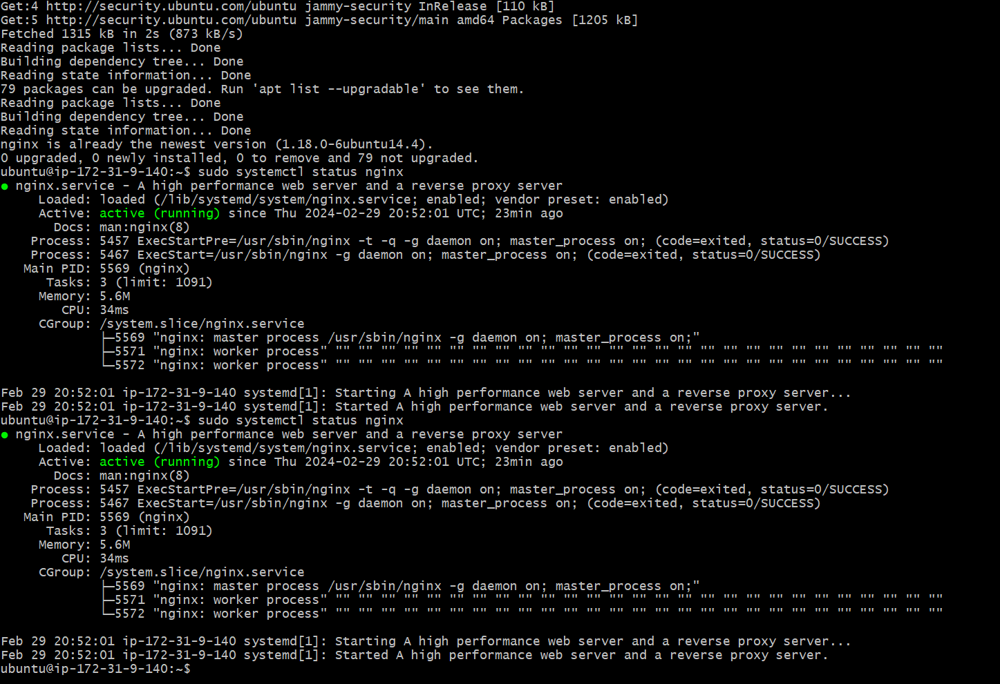

open Nginx configuration file with the command below:

Copy Below Code

`sudo vi /etc/nginx/conf.d/loadbalancer.cont`

Paste the configuration file below to configure nginx to act like a load balancer. A screenshot of an example config
file is shown below: Make sure you edit.the file and provide necessary information like your server IP address etc.

Copy Below Code

        
        `upstream backend_servers {

            # your are to replace the public IP and Port to that of your webservers
            server 127.0.0.1:8000; # public IP and port for webserser 1
            server 127.0.0.1:8000; # public IP and port for webserver 2

        }

        server {
            listen 80;
            server_name <your load balancer's public IP addres>; # provide your load balancers public IP address

            location / {
                proxy_pass http://backend_servers;
                proxy_set_header Host $host;
                proxy_set_header X-Real-IP $remote_addr;
                proxy_set_header X-Forwarded-For $proxy_add_x_forwarded_for;
            }
        }
    `

addresses and ports of your backend servers. proxy. pass inside the location block: sets up the load balancing.
passing the requests to the backend servers. The proxy_ set header lines pass necessary headers to the backend
servers to correctly handle the requests
Test your configuration with the command below:

Copy Below Code

`sudo nginx -t`

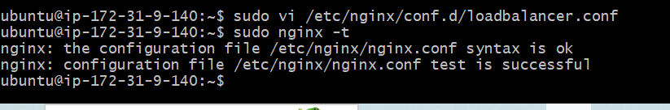

If there are no errors, restart Nginx to laod the new configuration with the command below:

Copy Below Code

`sudo systemctl restart nginx`

Paste the public IP address of Nginx load balancer, you should see the same webpages served by the webservers.

# Load Balancing Algorithms
## Load Balancing Algorithms
Load balancer algorithms are techniques used to distribute incoming network traffic or workload across multiple
servers, ensuring efficient utilization of resources and improving overall system performance, reliability, and availability.
Here are some common load balancer algorithms:

1. Round Robin: This algorithm distributes requests sequentially to each server in the pool. It is simple to implement
and ensures an even distribution of traffic. It works well when all servers have similar capabilities and resources.

2. Least Connections: This algorithm routes new requests to the server with the least number of active connections.
It is effective when servers have varying capacities or workloads, as it helps distribute traffic to the least busy
server.

3. Weighted Round Robin: Similar to the Round Robin algorithm, but servers are assigned different weights based
on their capabilities. Servers with higher capacities receive more requests. This approach is useful when servers
have varying capacities or perfamance I levels.

4. Weighted Least Connections: Similar to the Least Connections algorithm, but servers are assigned different
weights based on their capabilities. Servers with higher capacities receive more connections. This approach
balances traffic based on server capacities.

5. IP Hash: This algorithm uses a hash function based on the client's IP address to consistently map the client to a specific server. This ensures that the same client always reaches the same server, which can be helpful for
maintaining session data or stateful connections.

# SSL Termination and HTTPS Load Balancing
## SSL Termination and HTTPS Load Balancing
In this module we will be conniguring TLS/ SSL on our deployed website. But before doing so, let us take a brief r moment
to understand the purF pose of TLS certificate, how they work a and the technology behinde  it.

## Encryption
Encryption is at the heart of TLS/SSL. Encryption is the process of converting plain, readable data (referred to as
plaintext) into an unreadable format called ciphertext. The purpose of encryption is to ensure data confdentiality and.
protect sensitive information from unauthorized access or interception.
on.
In encryption, an algorithm (known as a cryptographic algorithm) and a secret key are used to transform the plaintext
into ciphertext. Only those who possess the correct key. can decrypt the ciphertext and convert it back into its original
plaintext form.

## Types of Encryption

Encryption can be classifed into several types based on various criteria, such as the encryption process, the key used.

and the level of security provided. Here are some common types of encryption:

####  1. Symmetric Encryption
Symmetric'encryption, the same key is used for both encryption and decryption processes. Both the sender and the
receiver must possess the shared secret key. While symmetric encryption is generally faster than other methods,
distributing and managing the secret key securely among all parties can be challenging. Examples of symmetric
encryption algorithms include Advanced Encryption Standard (AES) and Data Encryption Standard (DES)

####  2. Asymmetric Encryption
Asymmetric Encryption (Public-Key Encryption): Asymmetric encryption uses two distinct keys, a public key and a
private key. The public key is used for encryption, while the private key is used for decryption. Anyone can use the
recipient's public key to encrypt data, but only the recipient with the matching private key can decrypt and read the
data. This method eliminates the need for secure key distribution but is computationally more intensive than symmetric
encryption. Popular asymmetric encryption algorithms include RSA (Rivest-Shamir-Adleman) and Eliptic Curve
Cryptography (ECC).

####  3. Hybrid Encryption
Hybrid encryption combines both symmetric and asymmetric encryption, In this approach, the sender generates a
random symmetric key for each message and encrypts the actual data using this symmetric key (which is efficient for
large amounts of data). Then, the. sender encrypts the symmetric key using the recipient's public key and sends both the
encrypted data and the encrypted symmetric key to the recipient. The recipient can decrypt the symmetric key using
their private key and then use the symmetric key to decrypt the actual data. This method leverages the advantages of both symmetric and asymmetric encryption.
The Purpose of TLS/SSL Certificate
The main purpose of TLS/SSL certificates is to encrypt the data transmitted between the web server and the client. This
ensures that sensitive information, such as login credentials, personal data, or credit card details, remains confidential
and protected from eavesdropping.
A secondary benefit is to establish trust between webservers and their client. Before data is transmitted between client
and sever, the server needs to go through the process of authentication(server proves that its identity is genuine) by
presenting its certificate to the cleint which is validate by a trusted Certificate Authority CA.
There are terms such as CA, certificate that you may not understand at the moment. But not to worry, all these will be
explained in the next section.
How TLS/SSL Work
TLS/SSL works with hybrid encryption. This means that both syrnmetric and Asymmetric encryption is usedin TLS/SSL.
Before data is transmitted between client and server, the process of TLS Handshake is carried out.
During TLS handshake, the server shares with the client its digital certificate. The digital certificate contains the public
key of the server.
The client(browser) verifies the validity of the servers public key using the public key of the Certificate Authority CA. If
valid, the client encrypts it encryption key using the server's public key. This encrypted key is then sent to the server.

The client generates its encryption key using symmetric encryption. The implication is that its uses the same key for
both encryption and decryption hence the need to encrypt its key using the server public key.
Since the server is the only entity in possession of its private key, It is able to decrypt the clients encrypted key.
After the handshake process is completed, the client encrypts every data it sends to the server. The server is then able to
decrypt the data with theclient's encryption key.
This ensures that only the server is able to make sense of the data shared by the client.
Advanced Load Balancing Features
Advanced Load Balancing Features
Advanced features ofl load balancing enhance theg capabilities and efficiency oflond balancers in handling complex
scenarios and optimizing application performance. Here are some key advanced features:

#### 1. SSL Offloading/Termination: 

Load balancers can handle Secure Socket Layer (SSL) encryption and decryption on
behalf of backend servers. This offloading reduces the computational burden on application servers. enabling
them to focus on processing application logic instead of handling SSL/TLS encryption.

#### 2. Session Persistence/Sticky Sessions; 

Some applications require that a client's requests consistently go to the
same backend server to maintain session state, Load balancers can use techniques like cookie-based or IP-based persistence to ensure requests from a specific client are directed to the same server throughout the session.

#### 3. Health Checks and Automatic Server Failover: 

Load balancers can perform periodic health checks on backend
servers to monitor their availability and performance. If a server becomes unresponsive or unhealthy, the load
balancer can automatically remove it from the server pool, rerouting traffic to healthy servers, thus ensuring high
availability.

#### 4. Global Server Load Balancing (GSLB): 

GSLB enables load balancing across multiple data centers or
geographically distributed server clusters. It helps direct traffic to the nearest or most available data center,
optimizing user experience and providing disaster recovery capabilities.

#### 5. Application-Layer Load Balancing:

 Advanced load balancers can make routing decisions based on application-
specific attributes beyond traditional lP and TCP/UDP information. For example, they can inspect HT TP headers
or application-layer protocols to direct traffic based on content, URL, or user agent.

#### 6. Dynamic Load Balancing: 

Some load balancers use real-time analytics and machine learning to dynamically
adjust server weights or routing decisions based on current server performance, network conditions, and
application demands. This adaptability ensures efficient resource utilization.

#### 7. Anycast Load Balancing: 

Anycast allows multiple load balancer instances to share the same 1P address across
different locations. When a client sends a request, it is automatically routed to the nearest load balancer instance,
reducing latency and improving performance.

#### 8. Rate Limiting and Traffie Shaping:

 Load balancers can enforce rate limits on incoming requests from clients,
preventing denial-of-service attacks and controlling resource utilization. They can also shape traffic, prioritizing
certain types of requests over others based on defined policies.

#### 9. Web Application Firewall (WAF) Integration: 

Some load balancers offer integrated WAF functionality to protect
web applications from common security threats likssQL injection, cross-site scripting (XSS), and other
vulnerabilities.
These advanced features make load balancers powerful tools for optimizing application performance, ensuring high
availability. and protecting applications from various threats and failures. They are essentiat components in modern,
scalable. and robust IT infrastructures.

