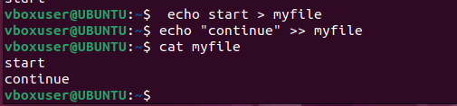
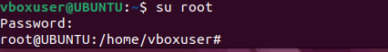

# Linux Practice Project
## File Manipulation 
### 1. sudo command
This is a superuser do command that enable user to perform a task that requires administrative or root permissions.

### 2. pwd command
This simply means a present working directory, this makes us to know the directories we are working from.

### 3. cd command
This command is used to change directory, that is to navigate fom one directories to another, just like move from one folder to another.

### 4. ls command
Ls command is simply usd to list directories or files

### 5. cat command
Cat command is used to write or read file contents to the standard output.

### 6. cp command
Cp command is used to copy files or folder from one source to another.

### 7 mv command
mv command: 
The primary use of the mv command is to move and rename files and directories

### 8. mkdir command:
Use the mkdir command to create one or multiple directories at once and set permissions for each of them.

### 9. rmdir command:
To permanently delete an empty directory, use the rmdir command.

### 10. rm command:
The rm command is-used to delete files within a directory.

### 11. touch command:
The touch command allows you to create an empty file or generate and modify a timstamp in a linux command line.

### 12. locate command:
The locate command can find a file in the database system.

### 13. find command
The find command to search for files within a specific directory and perform subsequent operations.

### 14. grep command:
Another basic Linux command on the list is grep or global regular expression print. It lets you find a word by searching
through all the texts in a specific file.

### 15. df command:
The df command to report the system's disk spare usage, shown in percentage and kilobyte (KB).

### 16. du command:
du command is used to check how much space a file or a directory takes up.

### 17.head command:
The head command allows you to view the first ten lines of a text. Adding an option lets you change the number of lines shown below:

### 18. tail command:
The tail command displays the last ten lines of a file. It allows users to check whether a file has new data or to read error messages.

### 19. diff command:
Short for difference, the diff command compares two contents of a file line by line. After analyzing them, it will display
the parts that do not match.

### 20. tar command:
The tar command archives multiple files into a TAR file - a common Linux format similar to ZIP, with optional compression.

## Introduction to Linux and Basic Commands
Linux is a family of open-source Unix operating systems based on the Linux Kernel. They include Ubuntu, Fedora,
Debian, openSUSE, and Red Hat. Using Linux to manage a Virtual Private Server (VPS) is common practice.
When operating Linux, you need to use a shell - a program that gives you access to the operating system's services. Most
Linux distributions use a graphical user interface (GUI), making them beginner-friendly.

However, we recommend utilizing the command-line interface (CLI) because it's quicker and offers more control. Tasks
that require multiple steps on the GUI can be done in a matter of seconds by entering commands into the CLI.
So if you want to use Linux, learning the common utilities or commands will go a long way.

## What Is a Linux Command?
A Linux command is a program or utility that runs on the CLI - a console that interacts with the system via texts and
processes. It's.similar to the Command Prompt application in Windows.
Linux commands are executed on Terminal by pressing Enter at the end of the line. You can run commands to perform
various tasks, from package installation to user management and file manipulation.

## File Permissions and Ownership
### 21. chmod command:
chmod is a common command that modifies a file or directory's read, write, and execute permissions. In Linux, each file is
associated with three user classes - owner, group member, and others.

### 22. chown command:
The chown command lets you change the ownership of a file, directory, or symbolic link to a specified username.

#### 23. jobs command:
A job is a process that the shell starts. The jobs command will display all the running processes along with their statuses.
Remember that this command is only available in csh, bash, tcsh, and ksh shells.

### 24. kill command:
Use the kill command to terminate an unresponsive program manually. It will signal misbehaving applications and
instruct them to close their processes.

### 25.ping command:
The ping command is one of the most used basic Linux commands for checking whether a network or a server is
reachable. In addition, it is used to troubleshoot various connectivity issues.

### 26. wget command:
The Linux command line lets you download files from the internet using the wget command. It works in the background
without hindering other running processes.

### 27. uname command:
The uname or unix name.command will print detailed information about your Linux system and hardware. 

### 29.history command:
With history, the system will list up to 500 previously executed commands, allowing you to reuse them without re-
entering. Keep in mind that only users with sudo privileges can execute this command. How this utility runs also depends
on which Linux shell you use

### 30. man command:
The man command provides a user manuald of any commands or utilitigs.

### 31. echo command:
The echo command is a built-in utility that displays a line of text or string using thé standard output. 

### 32. zip, unzip commands:
Use the zip command to compress your files into a ZIP file, a universal format commonly used on Linux. It can
automatically choose the best compression ratio.

### 33. hostname command:
Run the hostname command to know the system's hostname. You can execute it with or without an option.

### 34. useradd, userdel commands:
Linux is a multi-user system, meaning more than one'person can use it simultaneously. useradd is used to create
account, while the passwd command allows you to add a password. Only those with root privileges or sudo can
useradd command.

### 35. apt-get command:
apt-get is a command line tool for handling Advanced Package Tool (APT) libraries in Linux. It lets you retrieve
information and bundles from authenticated sources to manage, update, remove, and install software and its
dependencies.
Running the apt-get command requires you

### 36. nano, vi, jed commands:
Linux allows users to edit and manage files via a text editor, such as hano, Vi, or jed. nano and vid come with the opera
system, while jed has to be installed.
The nano command denotes keywords and can work with most languages. To use it, enter the following 

### 37. alias, unalias commands:
alias allows you to create a shortcut with the same functionality as a command, file name, or text. When exe
instructs the shellto replace one string with another.

### 38. su command:
The switch user or su command allows you to run a program as a different user. It changes the administrative ac
the current log-in session. This command is especially beneficial for accessing the system through SSH or using t
display manager when the root user is unavailable

### 39. htop command:
The htop command is an inter active program that monitors system resources and server processes in real time. It
available on most Linux distributions, and you can install it using the default package manager.

### 40. ps command:
The process status or ps command produces a snapshot of all running processes in your system. 

