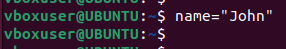
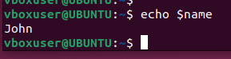

# Introduction to Shell Scripting and User Input
## Introduction to Shell Scripting and User Input
In our git course, we have been writing commands on the terminal and getting corresponding output. The commands are
instructions to the computer to carryout certain task.

For instance, when we want to clone a git repo, we type the command `git clone` and pass in the link to the repository.
In less than no time we see the repo downloaded into our local machine.

Lets say you are given a task to clone 1000 repositories. Yes you can type the `git clone` command 1000 times. That
gets the job done Someone with not so great patience maybe unable to complete the task.

This is where shell scripting commes in. Shell scripting helps you automate repetitive task. We can simply write a script
that does the job of cloning the 1000 repositories. We call it once and the job is done. We have the advantage of using it
agalin whenever we are signed same task.

Bash scripts are essentially a series of comnmands and instructions that are executed sequentially in a shell. You can
create a shell script by saving a collection of commands in a text file with a .sh extension. These scripts can be executed
directly from the command line or called from other scripts.
## Shell Scripting Syntax Elements
1. Variables: Bash allows you to define and work with variables. Variables can store data of various types such as numbers, strings and arrays. You can assign values to variable using the = operator, and access their values using the variable name preceeded by a $ sign.

Example: Assigning value to a variable:

`name-"John"`

Example: Retrieving value from a variable:

`echo $name`

2. Control Flow: Bash provides control flow statements like if-else, for loops, while loops, and case statements to
control the flow of execution in your scripts. These statements allow you to make decisions, iterate over lists,and
execute different commands based on conditions.
Example: Using if-else to execute script based on a conditions

`#!/bin/bash`

`#Example script to check if a number is positive, negative, or zero`

`read -p "Enter a number:`
`num`
`if [ $num -gt 0 ]; then`

`echo "The number is positive."`

`elif [ $num -lt 0 ]; then`

`echo "The number is negative."`

`else`

`echo "The number is zero."`

`fi`

The piece of code prompts you to type a number and prints a statement stating the number is

Example: Iterating through a list using a for loop
`#!/bin/bash`

 `#Example script to print numbers from 1 to 5 using a for loop` `

`for (( i=1; i<=5; i++ ))`

`do`
    `echo $i`
`done`
`

3. Command Substitution: Command substitution allows you to capture the output of a command and use it as a
value within your script. You can use the backtick or the $()syntax for command substitution.

Example: Using backtick for command substitution

`current date= date +%Y-%m-%d`

Example: Using $() syntax for command substitution

`current date: $(date +%Y-%m-%d)`

4. Input and Output: Bash provides various ways to handle input and output. You can use the read command to
accept user input, and output text to the console using the echo command. Additionahy, you can redirect input
and output using operators like > (output to a file), < (input from a file), and I (pipe the output of one command as input to another).

Example: Accept user input

`echo "Enter your name`

`read name`

Example: Output text to the terminal

`echo "Hello Wor1d"`

Example: Out the result of a command into a file

`echo "hello world"> index.txt`

Example: Pass the content of a file as input to a command

`grep "pattern" < input.txt`

Example: pass the result of a command as input to another command

`echo "hello world" | grep "pattern'`

5. Functions: Bash allows you to define and use functions to group related commands together. Functions provide a way to modularize your code and make it more reusable. You can define functions using the function keyword or simply by declaring the function name followed by parentheses.

`#!/bin/bash`

Define a function to greet the user
greet() 
{
      echo "Hello, $1! Nice to meet you." 
}

Call the greet function and pass the nanc as an argunent
greet "John" 

`

Lets write our First Shell Script
step 1:0n your terminal open a folder called shell-scripting using the command mkkdir shell- scripting This wil hold all the script we will write in this lesson.

step2:create a file called user-input sh using the command touch `user-input.sh`

step.3: Inside the file copyand paste the block of code below:

`#!/bin/bash

`Prompt the user for their name
echo "Enter your name:"
read name`

`Display a greeting with the entered name
echo "Hello, $name! Nice to meet you."
`

A litle bit about the code block. The script prompts for your name. When you type your name, it displays the text hello!
Nice to meet you. Also t!/bin/bash helps you specify the type of bash interpreter to be used to execute the script.
step 4: save your file
step 5:Run the command sudo chmod +x user-input.sh this makes the file executable
step 6: Run the script using the command. user-input.sh
Additional Resources
If you like text based learning material, this guide will be of help Learn-Shell-Scripting
Visit this link to learn shell scripting in an interactive environment for free.

# Directory Manipulation and Naxigation
## Directory Manipulation and Navigation
On the back of your lessons on Directory Manipulation and Navigation of Linux fle system, We will be writing a simple
shell script as a way of practicing what we learnt.
This script will display the current directory, create a new directory called "my_directory," change to that directory
create two files inside it, list the files, move back one level up, remove the"my_directory" and its contents, and finally list the file in the current directory again.

Proceed by the steps below.
Step 1. Open a file name navigating-linux-filesystems.sh

Step 2. Paste the code below into you file.

step 3: Run the command sudo chmod x navigating-linux-filesystem.sh to set execute permission on the file
step 4: Run your script using this command ./navigating-linux-filesystem.sh

# File Operations and Sorting
## File Operations and Sorting
In this lesson, we will be writing a simple shell script that focuses on File Operations and Sorting.
This script creates three files (file1.txt, file2.txt, and file3.txt), displays the files in theur current order, sorts them
alphabetically, saves the sorted files in sorted_files.txt, displays the sorted files, removes the original files, renames the
sorted file to sorted_files_sorted_alphabetically.txt, and finally displays the contents of the final sorted file.
Lets proceed using the steps below:
step 1: Open your terminal and create a file called sorting.sh using the command t ouch sorting. sh
step 2: Copy and paste the code block below into the file.

