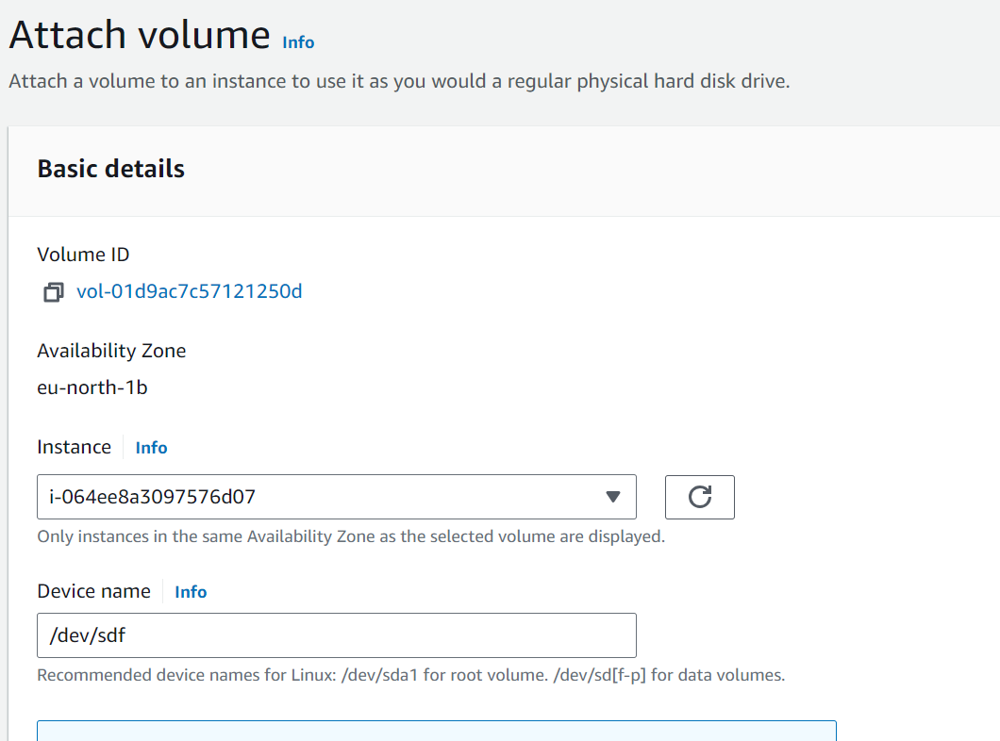

# Implementing Wordpress websitewith LVM Storage management

Implementing WordPress Website with LVM Storage Management on AWS EC2 Ubuntu Course Description: Welcome
to the Implementing WordPress Website with LVM Storage Management on AWS EC2 Ubuntu Course. lf you're eager
to learn how to build and manage a scalable WordPress website using AWS EC2 and LVM (Logical Volume Management)
storage, this comprehensive course is tailored specifically for you. Gain the knowledge and skills needed to deploy and
maintain a robust WordPress site on the AWS cloud platform. Designed with beginners in mind, this course provides a
step-by-step introduction to implementing WordPress on AWS EC2 using Ubuntu as the operating system.

You'll learn how to set up an EC2 instance, configure security groups, and establish a reliable connection to your
website. Through practical demonstrations and hands-on exercises, you'll delve into the intricacies of LVM storage
management on Ubuntu. We'lguide you through the process of creatingl pgical volumes, managing disk space, and
dynamically resizing volumes to accommodate changing storage requirements. As part of the course, you'l gain
proficiency in installing and configuring WordPress, customizing themes, and adding essential plugins to enhance your
website's functionality. We'l cover performance optimization techniques and best practices for securing your
WordPress installation on the AWS cloud. Our experienced instructor will provide expert guidance and insights into
managing a WordPress website on AWS EC2 with LVM storage, You'llearn how to handle common challenges,
troubleshoot issues, and effectively manage your website's resources.

By the end of this course, you'll have the necessary knowledge and skills to successfully implement and manage a
WordPress website on AWS EC2 using LVM storage management. Whether you're a web developer, system
administrator, or aspiring AWS DevOps professional, this course will empower you to leverage the power of AWS cloud
infrastructure to build scalable and reliable WordPress sites. Join us on this transformative journey into the world of
WordPress and AWS EC2, and unlock the potential to create and manage dynamic websites with confidence. Enroll now
and take the first step towards mastering WordPress and AWS integration with LVM storage management.

# Understanding 3 Tier Architecture
## Web Solution With WordPress
You are progressing in practicing to implement web solutions using different technologies. As a DevOps engineer you
willmost probably encounter [PHP](https://www.php.net/)-based solutions since, even in 2021, it is the dominant web programming language
used by more websites than any other programming language.
In this project you will be tasked to prepare storage infrastructure on two Linux servers and implement a basic web
solution using [WordPress](https://en.wikipedia.org/wiki/WordPress). WordPress is a free and open-source content management system written in PHP and paired
with MySQL or MariaDB as its backend Relational Database Management System (RDBMS).
Project 6 consists of two parts:

1. Configure storage subsystem for Web and Database servers based on Linux OS. The focus of this part is to g
you practical experience of working with disks, partitions and volumes in Linux.

2. Install WordPress and connect it to a remote MySQL database server. This part of the project will solidify yo
skills of deploying Web and DB tiers of Web solution.

As a DevOps engineer, your deep understanding of core components of web solutions and ability to troubleshoot
will play essential role in your further progress and development.

### Three-tier Architecture
Generally, web, or mobile solutions are implemented based on what is called the Three-tier Architecture.
Three-tier Architecture is a client-server software architecture pattern that comprise of 3 separate layers.

1. Presentation Layer (PL): This is the user interface such as the client server or browser on your laptop.
2. Business Layer (BL): This is the backend program that implements business logic. Application or Webserver
3. Data Access or Management Layer (DAL): This is the layer for computer data storage and data access. [Database
Server](https://www.computerhope.com/jargon/d/database-server.htm) or File System Server such as FTP server, or [NFS Server](https://www.techtarget.com/searchenterprisedesktop/definition/Network-File-System)

In this project, you will have the hands-on experience that showcases Three-tier Architecture while also ensuring that
the disks used to store files on the Linux servers are adequately partitioned and managed through programs such as
`gdisk` and `LVM` respectively.
You willbe working working with several storage and disk management concepts, to have a better understanding, watch
following video: Disk management in Linux
Note: We are gradually introducing new AWS elements into our solutions, but do not be worried if you dò not fully
understand AWS Cloud Services yet, there are Cloud focused projects ahead where we will get into deep details of
various Cloud concepts and technologies- not only AWS, but other Cloud Service Providers as well.
Your 3-Tier Setup
1. A Laptop or PC to serve as a client

2. An EC2 Linux Server as a web server (This is where you will install Wordpress)
3. An EC2 Linux server as a database (DB) server.

Use `RedHat` OS for this project.

By now you should know how to spin up an EC2 instanse on AWS, but if you forgot - refer to [Project1 Step 0](). In previous
projects we used 'Ubuntu', but it is better to be well-versed with various Linux distributions, thus, for this projects we willuse very popular distribution called [RedHat](https://www.redhat.com/en) (it also has a fully compatible derivative - [CentOS](https://www.centos.org/)

Note: for Ubuntu server, when connecting to it via SSH/Putty or any other tool, we used buntu user, but for RedHat
you will neèed to use c2-user user. Connection string will look like ec2-user@kPublic-IPs
Let us get started!
Instructions On How To Submit Your Work For Review And Feedback
To submit your work for review and feedback - follow this instruction.

# Implementing LVM on Linux servers (Web and Database servers)

#### Step 1- Prepare a Web Server

1. Launch an EC2 instance that will serve as "Web Server", Create 3 volumes in the same AZ as your Web Server
EC2,each of 10 GiB

Learn How to Add EBS Volume to an EC2 instance here

2. Attach all three volumes one by one to your webserver EC2 instance.

2. Open up the Linux terminal to begin configuration

3. Use 1sblk command to inspect what block devices are attached to the server. Notice names of your newly
created devices. A ll devices in Linux reside in /dev/ directory. Inspect it with ts /dev/ and make şure you see all
3 newly created block devices there - their names wilL likely be xvdf , xvdh , xevdg.

4.Use df h command to see all mounts and free space on your server
5.Use gdisk utility to create a single partition on each of the 3 disks

Copy Below Code

`sudo gdisk /dev/xvdf`

Output """ GPT fdisk (gdisk) version 1.0.3
Partition table scan: MBR: not present BSD: not present APM: not present GPT: not present
Creating new GPT entries.
Command (? for help branch segun-edits: p Disk /dev/xvdf: 20971520 sectors, 10.0 GiB Sector size (logical/physical):
512/512 bytes Disk identifer (GUID): D936A35E-CE80-41A1-B87,> 54D2044D160B Partition table holds up to 128
entries Main partition table begins at sector 2 and ends at sector 33 First usable sector is 34, last usable sector is
20971486 Partitions will be aligned on 2048-sector boundaries Total free space is 2014 sectors (1007.0 KiB)
Number Start (sector) End (sector) Size Code Name 1 2048 20971486 10.0 GiB 8E00 LinuxLVM
Command (? for help): w
Final checks complete. About to write GPT data. THIS WILL OVERWRITE EXISTING PARTITIONS!!
Do you want to proceed? (Y/N): yes OK: writing new GUID partition table (GPT) to /dev/xvdf. The operation has
completed successfully. Now, your changes has been configured succesful, exit out of the gdisk console and do the
same for the remaining disks. """"

5. Use `lsblk` utility to view the newly configured partition on each of the 3 disks.

6. Install lvm2 package using sudo yum install lvm2 . Run sudo vmdiskscan command to check for available
partitions.
Junior
Note: Previously, in Ubuntu we used apt command to install packages, in RedHat/CentoS a different package
manager is used, so we shall use yum command instead.

7. Use pvcreate utility to mark each of 3 disks as physical volumes (PVs) to be used by LVM.

Copy Below Code

`sudo pvcreate /dev/xvdf1`

`sudo pvcreate /dev/xvdg1`

`sudo pvcreate /dev/xvdh1`

8. Verify that your Physical volume has been created successfully by running do pvs

9. Use `vgcreate` utility to add all 3 PVs to a volume group (VG). Name the VG webdata-vg.

Copy Below Code

`sudo vgcreate webdata-vg /dev/xvdhl /dev/xvdgl /dev/xvdf1`

10. Verify that your VG has been created successfully by running `sudo vgs`

11. Use lvcreate utility to create 2 logical volumes. apps-lv (Use half of the PV size), and logs-lv Use the remaining
space of the PV size. NOTE: apps-lv will be used to store data for the Website while, logs-lv will be used to store data for logs.

Copy Below Code

`sudo lvcreate -n apps-lv L 14G webdata-vg`

`sudo lvcreate -n logs-lv -L 14G webdata-vg`

12. Verify that your Logical Volume has been created successfully by running `sudo lvs`

13. Verify the entire setup

`sudo vgdisplay -v #view complete setup - VG, PV, and LV`

`sudo lsblk`

14. Use mnkfs. ext4 to format the logical volumes with ext4 filesystem

Copy Below Code

`sudo mkfs -t ext4 /dev/webdata-vg/apps-lv`

`sudo mkfs -t ext4 /dev/webdata-vg/logs-lv`

15. Create /var/www/html directory to store website files

`sudo mkdir -p /var/www/html`

16. Create/home/recovery/logs to store backup of logdata

`sudo mkdir -p /home/recovery/logs`

17. `Mount /var/www/html` on apps-lv logical volume

`sudo mount /dev/webdata-vg/apps-lv /var/www/html/`

Copy Below Code

18. Use `rsync` utility to backup all the files in the log directory /var/log into /home/recovery/logs (This is required
before mounting the file system)

Copy Below Code

`sudo rsync -av /var/log/. Yhome/recovery/logs/`

